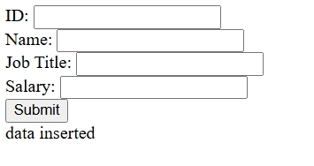
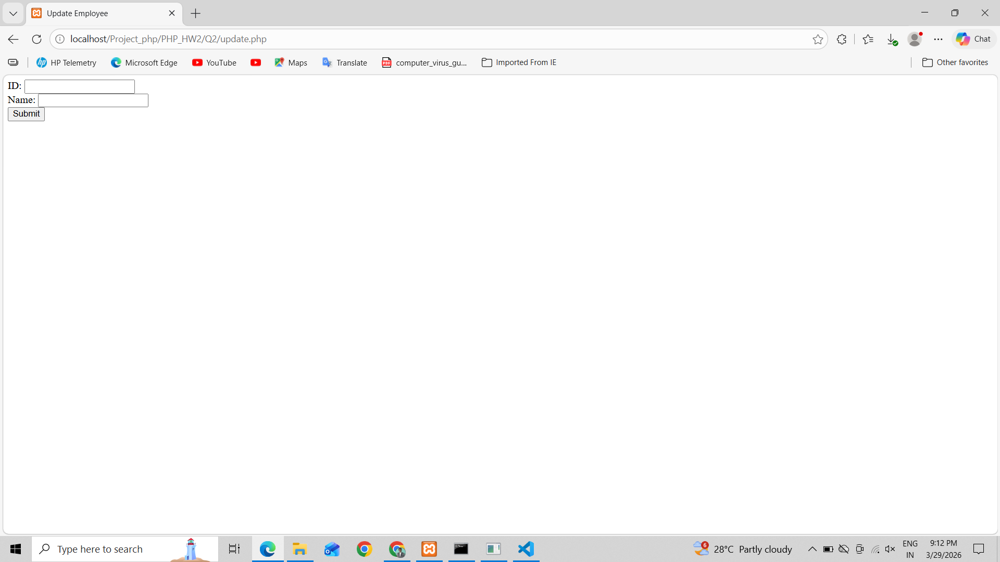
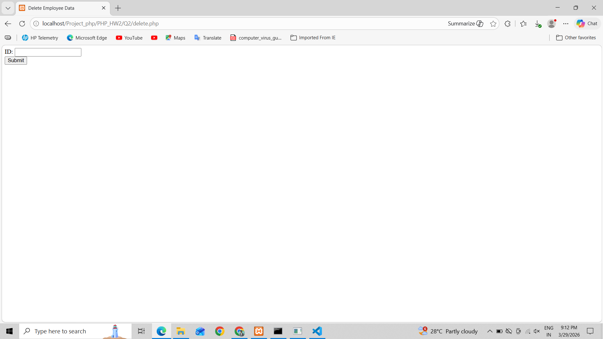
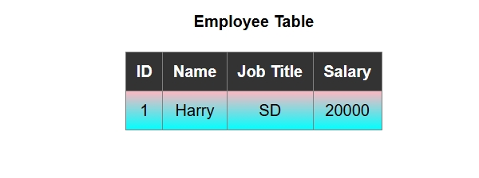
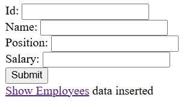
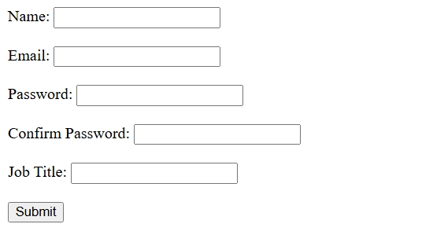

📌 Homework No 2.

📖 Overview

The Employee Management System is a simple web-based application developed using PHP and MySQL. It allows users to manage employee records efficiently by performing basic CRUD (Create, Read, Update, Delete) operations.

This project is beginner-friendly and helps in understanding how backend and database integration works in real-world applications.

📂 Folder Structure

PHP_HW2 │── Q1 #inside folder use php files accordingly|── Q2 #inside folder use php files accordingly|── Q3 #inside folder use php files accordingly|── Q4 #inside folder use php files accordingly│── README.md # Project documentation

🚀 Main Features

✔ Add new employee details ✔ View all employee records in table format ✔ Update existing employee information ✔ Delete employee records ✔ Simple and user-friendly interface ✔ Lightweight and fast performance

⚙️ How to Run the Project

Copy the project folder to: C:\xampp\htdocs\

Open phpMyAdmin and create a database: employee_db

Run the following SQL query:

CREATE TABLE employees ( id INT AUTO_INCREMENT PRIMARY KEY, name VARCHAR(100), email VARCHAR(100), job_title VARCHAR(100), salary INT );

Open your browser and run: http://localhost/PHP_HW2/(Q1)/db.php

🛠️ Technologies Used

HTML
CSS
Bootstrap
XAMPP
PHP
Mysql

📸 Screenshots

### 🏠 Q1

### 🏠 Q2

### 🏠 Q3

### 🏠 Q4

